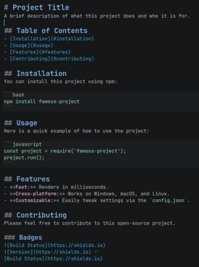
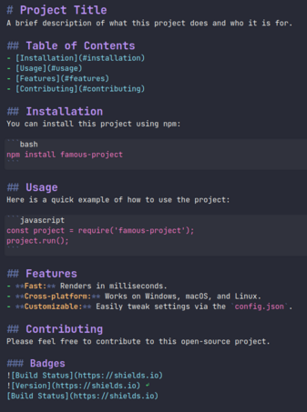
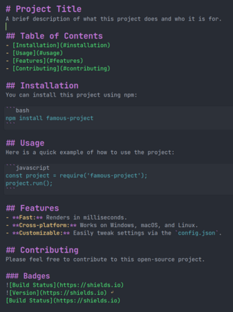
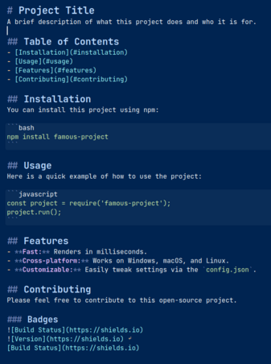

## My fav dark themes for Ghostwriter editor 
This repository contains my favorite dark themes for [Ghostwriter editor](https://ghostwriter.kde.org/).

- **Blue Constrast** Highly usable and highly optimized for reading comfort in both light and dark modes. 100% [WCAG](https://www.w3.org/WAI/standards-guidelines/wcag/) AA compliant, the global standard for digital accesibility created by [W3C](https://www.w3.org/).
- **Dracula** - [Offical Dracula website](https://draculatheme.com/ghostwriter)
- **One Dark** - [GitHub](https://github.com/drigovz/one-dark-theme-ghostwriter/tree/main)
- **Tomorrow night blue** - [GitHub](https://github.com/chriskempson/tomorrow-theme)

## Take a look!

**Blue Contrast** (WACG compliant). Highly usable.\

**Dracula** - [Offical Dracula website](https://draculatheme.com/ghostwriter)\

**One Dark** - [GitHub](https://github.com/drigovz/one-dark-theme-ghostwriter/tree/main)\

**Tomorrow night blue** - [GitHub](https://github.com/chriskempson/tomorrow-theme)\

## How to install:
After download files of GitHub, you will need to copy _.json_ file to config directory of ghostwriter themes located on:

-   **Windows:** `C:\Users\<your_user_name_here>\AppData\Roaming\ghostwriter\themes\`
-   **Windows portable version:** `<ghostwriter_portable_folder>\data\themes\`
-   **GNU/Linux**: 
    - **Ubuntu 24.04+:** `~/.local/share/ghostwriter/themes/`
    - **Ubuntu older versions**: `~/.config/ghostwriter/themes/`
    - **Fedora 43 using flakpak**: `~/.var/app/org.kde.ghostwriter/data/ghostwriter/themes`
-   **macOS**: `~/Library/Application Support/ghostwriter/themes/`

## References:
How to install a ghostwriter app. <https://github.com/drigovz/one-dark-theme-ghostwriter/blob/main/INSTALL.md>
